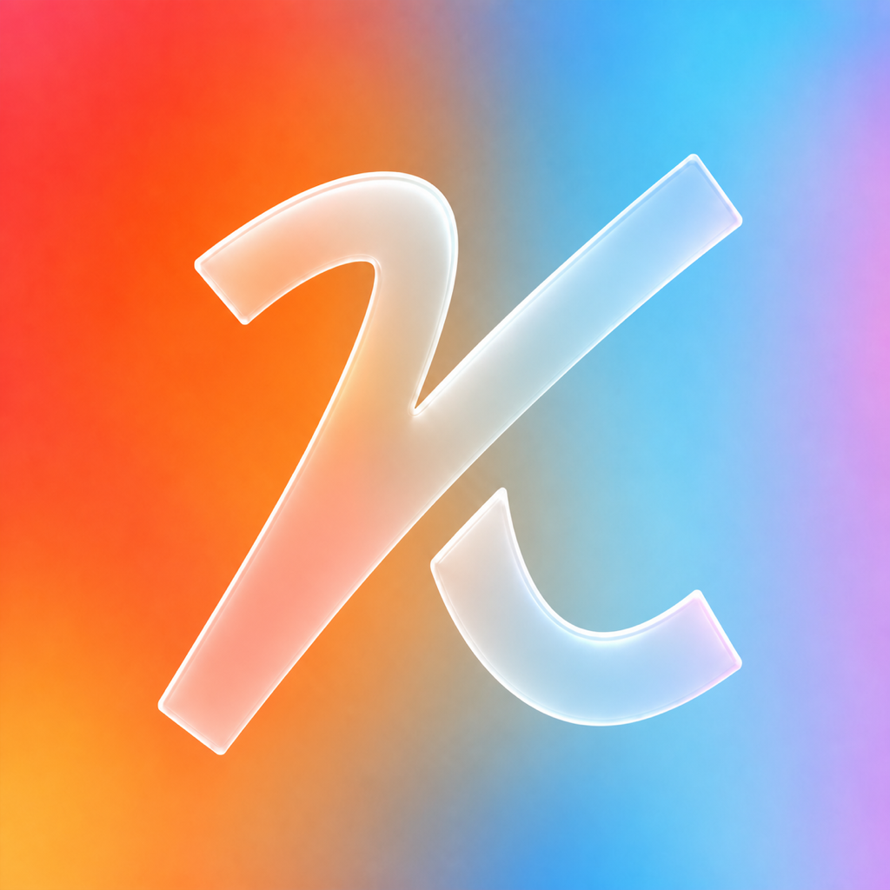

<p align="center">
  
</p>

<h1 align="center">Keyer</h1>

<p align="center">Local dictation for macOS</p>

Hold Fn, speak, and release. Keyer transcribes on your Mac, copies the text to the clipboard, and pastes it into the focused field when macOS allows it.

Keyer uses [Parakeet TDT 0.6B v3](https://huggingface.co/nvidia/parakeet-tdt-0.6b-v3) through [FluidAudio](https://github.com/FluidInference/FluidAudio). Language detection is automatic, including mixed-language speech. Dictations are saved as Markdown files in iCloud Drive. Speech and cleanup never leave the Mac.

## Requirements

- Apple Silicon Mac
- macOS 26 or newer
- Xcode 26.6 or newer for local builds
- 461 MB model download on first use
- Microphone, Accessibility, and Input Monitoring permissions

## Build

```sh
swift test
./scripts/build-local.sh
open "build/Release/Keyer.app"
```

You can also open `Keyer.xcodeproj` and run the `Keyer` scheme.

## Benchmarks

Measured on a 14-core M4 Pro MacBook Pro with 24 GB RAM. The Release build used FluidAudio 0.15.6, CPU plus Neural Engine inference, and concurrency 4.

| Audio | Runs | p50 | p95 | Peak footprint | Failures |
| --- | ---: | ---: | ---: | ---: | ---: |
| 1 hour | 10 | 17.25 s | 17.76 s | 99.0 MB | 0 |
| 2 hours | 5 | 29.35 s | 29.54 s | 95.9 MB | 0 |

The test repeats a deterministic English, Spanish, Portuguese, and code-switched fixture. It measures throughput, memory, and long-audio stability. It does not measure human-speech word error rate. See [the benchmark notes](docs/BENCHMARKS.md) for the method, raw timings, and tuning results.

## Behavior

- Fn is the default shortcut and can be changed in Settings
- Escape cancels the current recording
- A dictation finalizes automatically at 15 minutes
- Successful dictations sync to iCloud Drive as Markdown with YAML front matter
- The model can be removed from Settings

## Privacy

Keyer has no hosted speech service, OpenRouter integration, analytics, telemetry, advertising, or crash reporter. See [PRIVACY.md](PRIVACY.md) for storage and permission details.

## License

[MIT](LICENSE). Third-party code, models, and icons keep their original licenses. See [THIRD_PARTY_NOTICES.md](THIRD_PARTY_NOTICES.md).
